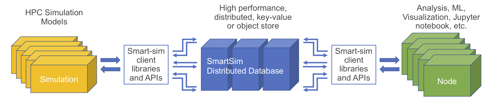

# SmartSim
 - In this repository are the additional materials for the paper submitted to Supercomputing 2020 about SmartSim.
 

 
### Contents
 - **MOM6** The directory containing the changes made to the MOM6 source code to support SmartSim. We are including these      changes as we find that it is important to see how SmartSim is incorported in this particular instance, but also hopefully to give an idea of the small amount of work required to utilize Smartsim.
 - **SmartSim.ipynb** is the notebook detailed as the second example in the paper. Users will have to obtain a copy
   the SmartSim source code to run the notebook, but the source code is not currently open-source.
 - **Figures** A directory containing the figures from the paper
 - **Timing-Data** A directory containing the timings used to create the plots.
 - **Data-assimilation.py** The python script used in the data assimilation application.
 - **Reconstruct.py** The domain recontruction script used for ploting figures within the Jupyter notebook.
